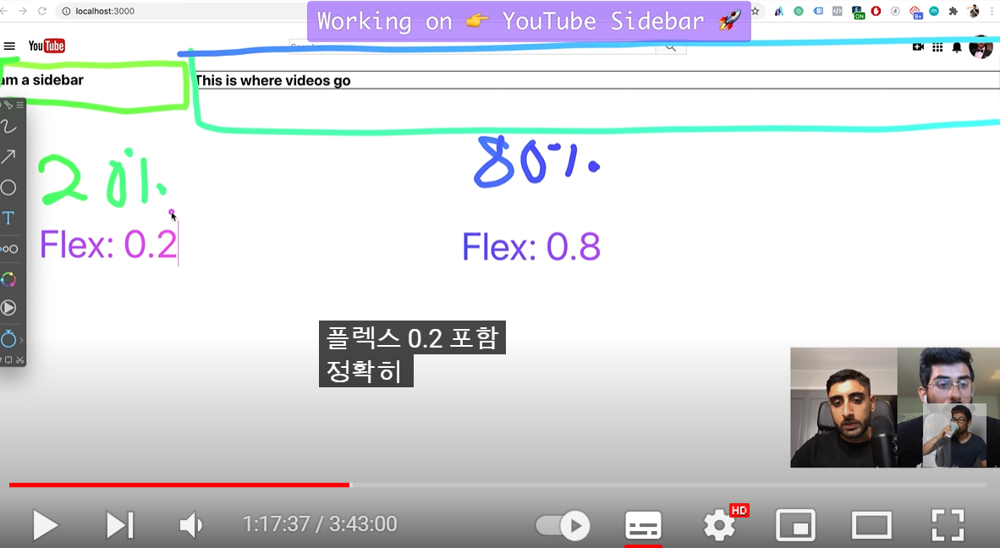

# Note (프로젝트 완료 후 정리 예정)

## webpack css loader 설정하기
1. style-loader, css-loader 설치하기
```js
  module: {
    rules:
    {
      test: /\.css$/i,
      use: ["style-loader", "css-loader"],
    },
  },

```
> 참고
> [css-loader (webpack 공식문서)](https://webpack.js.org/loaders/css-loader/)

## 스니펫 플러그인 단축키
- VS Code ES7+ React/Redux/React-Native/JS snippets
- rfce

## Material UI 사용..

[Installation (공식문서)](https://mui.com/material-ui/getting-started/installation/)

## import * as React from 'react'

## import * as React from 'react'
- Cannot read properties of null (reading 'useContext') 이 에러가 자꾸 난다..
- mui 에러가 자꾸 나서 font-awesome으로 바꿔버림.

<에러 이유>
- import * as React from 'react' 이렇게 해주질 않아서 그랬다.
- export default 없는 애들이나 module.exports로 된 애들은 * as로 해야 합니다. * as는 자바스크립트에도 존재하는 문법입니다. 모든 export들을 모아서 하나의 변수 안에 모아줍니다.

- [fontawesome - package-names]<https://fontawesome.com/v6/docs/apis/javascript/import-icons#package-names>

### 문제점
- webpack을 설정해서 사용하는 중인데 @mui/icons-material 만 깔면 빌드 시간이 너~~~~~무 오래걸린다. 5분정도 걸림. 공식문서에는 Tree Shaking을 사용하라고 나와있는데 아직 성공하지 못함

## 이미지 crop
- object-fit 사용
- object-fit: contain;

## babel
바벨에 exclude 하듯이 include 할 수도 있음

## Styled-components 자식 컴포넌트에  커스텀 css  props로 전달하기
<https://devbirdfeet.tistory.com/177>

- 스타일 컴포넌트로 같은 컴포넌트에 온클릭했을 때 배경색이 변하게 햇지만 먹히질 않았음.
```js
const RowContainer = styled.div`
  :hover {
  background-color: #f2f2f2;
  cursor: pointer;
  }
`

const Row = styled.div`
  display: flex;
  flex-direction: column;
  align-items: center;
  padding: 16px 0 16px;
  transition: all 2s;

  ${({ clicked }) =>
    clicked &&
    css`
      background-color: rgba(210, 210, 210);
    `
  }

  .title {
    margin: 0;
```
- hover시에 이미 배경이 설정되어있었고 클릭했을 때 배경을 변경해야했는데 중복이 돼서 그런지 되지 않았음. 그래서 div로 한번더 감싸줌

- transition을 넣으면.. prop으로 받아서 적용하는 css가 적용이 안됨 왜지? 왜지! 
- 클릭하자마자 색이 변하게 할 수 없나?


## CSS, flex
- !important 속성값 강제 우선적용

- flex: 0.2; 20%만큼만 차지 0 ~ 1값  


- 상단에 바로 뜨는 걸 모달이라고 하는구나

## Loaders for Webpack
- babel-loader: Babel용 로더
- html-loader: HTML용 로더
- style-loader: DOM에 스타일을 주입하는 로더
- css-loader: CSS용 로더
- sass-loader(*): SASS/SCSS용 로더

## webpack에서 svg 설정하기 : asset modules
- webpack 5 이전에는 로더를 사용해서 구현했으나 로더를 대체하기 위해서 4가지 모듈이 나왔다고 한다.

```js
 module: {
    rules: [
      {
        test: /\.svg/,
        type: 'asset/inline'
      },
    ]
 }
```
- 설치할 건 없고 rules에 추가해주면 된다.
[Asset Modules](https://webpack.kr/guides/asset-modules/)

## webpack-dev-server
- 개발용 서버를 제공해줌

[](https://jeonghwan-kim.github.io/series/2019/12/10/frontend-dev-env-webpack-basic.html)

- before 속성
  - 웹팩 서버에 기능을 추가할 수 있는 여지를 제공한다.
  - express는 미들웨어 형태로 서버 기능을 확장할 수 있는 웹프레임웍이다. devServer.before에 추가하는 것이 바로 미들웨어인 셈


```js
  devServer: {
    historyApiFallback: true,
    port: 9000,
    open: true, //서버 띄워지면 창 자동으로 열기
    hot: true,
    // overlay: true,
    // stats: 'errors-only', // 메세지 표시 수준 조절 (none, minimal, normal, verbose)
    devMiddleware: { publicPath: '/dist' },
    static: { directory: path.resolve(__dirname) },
    headers: {
      "Access-Control-Allow-Origin": "*",
      "Access-Control-Allow-Methods": "GET, POST, PUT, DELETE, PATCH, OPTIONS",
      "Access-Control-Allow-Headers": "X-Requested-With, content-type, Authorization"
    },
    proxy: {
      '/api/': {
        // target: 'http://localhost:8080/',
        target: 'http://www.googgleapis.com/youtube/v3/',
        changeOrigin: true,
        pathRewrite: { '^/api': '' },
      },
    },
  }
```
## console.log(location.origin); 어플리케이션이 실행되고 있는 출처

## 너무 힘들었던 CORS 에러
[교차 출처 리소스 공유 (CORS) by MDN](https://developer.mozilla.org/ko/docs/Web/HTTP/CORS)


- CORS란?
  - Cross-Origin Resource Sharing의 줄임말 : 교차 출처 리소스 공유(교차 출처란 다른 출처를 의미)

- 교차 출처 요청의 예시
  - https://domain-a.com의 프론트 엔드 JavaScript 코드가 XMLHttpRequest를 사용하여 https://domain-b.com/data.json을 요청하는 경우.

- 보안상의 이유로 XMLHttpRequest와 Fetch API는 동일 출처 정책을 따르기 때문에 자신의 출처와 동일한 리소스만 불러올 수 있다. 다른 출처의 리소스를 불러오기 위해서는 그 출처에서 올바른 CORS 헤더를 포함한 응답을 반환하거나 다른 방법을 적용해야 한다.


- SOP
  - CORS같은 정책
  - Same-Origin Policy (같은 출처에서만 리소스를 공유할 수 있다.)
  - 하지만 몇 가지 예외 조항을 두는데 그 중 하나가 "CORS" 정책을 지킨 리소스 요청이다.

- 두 URL의 구성 요소 중 Scheme, Host, Port, 이 3가지만 동일하면 된다.


- 정리해야 할 것
- 출처를 구분짓는 것
- CORS는 브라우저 구현 스펙에 포함되는 정책
- Preflight Request
- Simple Request
- Credentialed Request
- CORS를 해결할 수 있는 방법
- 내가 마주친 상황
  - 클라이언트에서 바로 API를 요청했다. 이 경우에는 서버라고는 webpack-dev-server밖에 가지고 있지 않았는데 프록시서버가 필요하다고들 했다. webpack-dev-server에서 설정하는 프록시 설정으로는 해결되지 않았다. 또는 내가 잘못 설정했거나.. proxy 설정을 하는 건 프론트서버와 백엔드서버가 따로 나눠져있을 때 사용하는 것 같다. 나중에 한 번 더 해봐야겠다.
- 클라이언트에서 외부 API를 요청했을 때
  - 외부 api를 사용하고 있기 때문에 서버를 제어할 수 없다.
  - cors는 브라우저에 관련된 정책이기 때문에 서버 간의 통신에는 이 정책이 적용되지 않는다.
- 클라이언트 단계에서 cors 이슈를 해결하려면? 
  - -> 프록시 미들웨어를 이용
  - 프록시 서버는 클라이언트가 프록시 서버를 통해 다른 네트워크에 간접적으로 접속할 수 있게 해준다. 쉽게 중계서버라고 이해하면 된다.
  - 프록시를 사용해서 클라이언트의 요청을 프록시가 받고 프록시가 서버에 도착해서 웹페이지를 가져다 클라이언트에 주도록 해야 한다.
<https://developer.mozilla.org/ko/docs/Web/HTTP/CORS>
<https://evan-moon.github.io/2020/05/21/about-cors/>


## https://www.googleapis.com/youtube/v3/search?key=apiKey&type=video&part=snippet&q=foo 주소 분석하기
- www.googleapis.com : host
- youtube : youtube api
- v3 : 버전
- search : route
- key=apiKey

## 웹의 환경은 클라이언트와 서버로 이루어져 있다.
- 이번에야 더 잘 알게 되었다. 요청하는 쪽이 클라이언트 요청을 받는 쪽이 서버!

## webpack dev server
- 웹팩 데브 서버는 작은 Node.js Express 서버 : 결국 미들웨어인 것?
- webpack-dev-middleware를 사용하여 웹팩 번들 서버를 제공
- 웹팩 개발 서버는 오직 웹팩된 정적 자원들을 제공하기 위한 목적

## 툴체인이란?
- 주로 다른 컴퓨터 또는 시스템의 소프트웨어 제품을 만드는 데 사용되는 컴퓨터 프로그램 개발 도구들의 집합이다. 

## express 설정
[How to Use YouTube API in Node - Full Tutorial](https://www.youtube.com/watch?v=3VHCxuxtuL8)
- app.get (주소, 라우터)
  - 주소에 대한 get 요청이 올 때 어떤 동작을 할지 적는 부분
  - req : 요청에 관한 정보가 들어 있는 객체
  - res : 응답에 관한 정보가 들어 있는 객체

- GET 요청 외에도 POST, PUT, PATCH, DELETE, OPTIONS에 대한 라우터를 위한 app.post, app.put, app.patch. app.delete, app.options 메서드가 존재

### req.query
- express에서 제공하는 메서드
- ? 뒤에 입력되는 query를 받아옴
[[EXPRESS] 📚 req.params / req.query / req.body 🤔 정리](https://inpa.tistory.com/entry/EXPRESS-%F0%9F%93%9A-reqparams-reqquery-reqbody-%F0%9F%A4%94-%EC%A0%95%EB%A6%AC)

### req.params
- 라우터 매개변수

### 미들웨어
- 미들웨어는 익스프레스의 핵심
- 요청과 응답의 중간에 위치
- 라우터, 에러 핸들러 또한 미들웨어
- 미들웨어는 app.use와 함께 사용된다.
- app.use(미들웨어)
- 익스프레스 4.16.0 버전부터 body-parser 미들웨어의 일부 기능이 익스프레스에 내장되어서 설치안해도 됨
  - 단, body-parser를 직접 설치해야 하는 경우도 있습니다. body-parser는 JSON과 URL-encoded 형식의 데이터 외에도 Raw, Text 형식의 데이터를 추가로 해석할 수 있습니다.
  - 버퍼데이터나 텍스트 요청을 처리할 필요가있다면 설치해야함

## 환경변수
- .env 파일 만들기
- cra으로 만들면 dotenv가 내장돼있다.
- dotenv 설치하기 -> npm i dotenv
- cra일 때 환경변수 설정하려면 변수명 앞에 REACT_APP으로 시작해야함
- cra으로 설정하지 않으면 import도 해주어야함

```js
const webpack = require('webpack');
const dotenv = require('dotenv');
dotenv.config();

...

new webpack.DefinePlugin({
			'process.env': JSON.stringify(process.env),
		}),
```
### webpack.DefinePlugin
- 웹팩에서 제공하는 플러그인으로, 모든 자바스크립트 코드에서 접근이 가능한 전역변수를 선언하기 위해 사용되는 플로그인이다.


## __dirname 
- 현재 경로